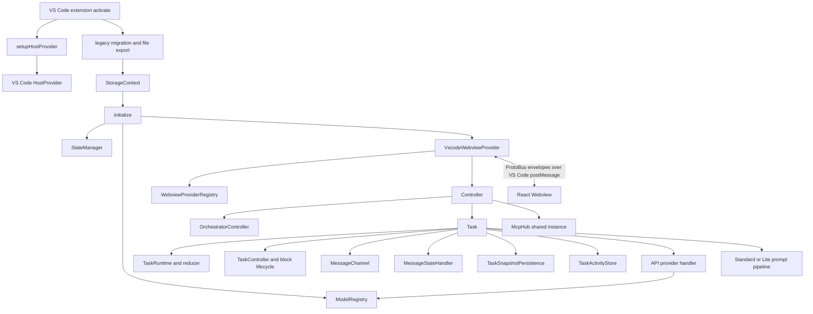

# Dline VS Code Extension Architecture

## Product surface

Dline currently ships as one VS Code extension with an embedded React Webview. `package.json` exposes `dist/extension.js` as the published extension entry; the future independent executable is not a current release or acceptance surface.

`src/core` is an internal source-code grouping, not a separately deployed “shared core” product. `src/standalone`, `src/hosts/external`, standalone build scripts, HostProvider abstractions, and generated standalone transport files are retained architecture for the future independent executable. They must not be deleted or described as obsolete merely because the current release ships only the VS Code extension.

Use this file as navigation for the current VS Code runtime, not as a substitute for reading the implementation and owning tests.

## Runtime architecture

## VS Code host boundary

- `src/extension.ts` is the only current production activation entry. It installs the VS Code host capabilities, runs migrations, creates `StorageContext`, initializes runtime services, and registers sidebar/panel behavior.
- `HostProvider` keeps task and service modules independent from concrete editor APIs and preserves the host contract needed by both the current VS Code extension and the future independent executable.
- `src/hosts/vscode/` owns the current host implementations, including Webview, terminal, diff, review, and generated host-bridge handlers.
- Proto host contracts and generated bridge files support typed host communication. Standalone projections are reserved for the future independent executable even though they are not part of the current release gate.

Keep VS Code API calls at the host/integration boundary. Current extension changes must preserve host-neutral contracts, but they do not require standalone acceptance work unless the task explicitly includes the future executable.

## Webview lifecycle and transport

- `VscodeWebviewProvider` owns VS Code sidebar binding; `WebviewProvider` owns the reusable lifecycle used by the sidebar and editor panels.
- `WebviewProviderRegistry` tracks the sidebar and additional panels. Do not reintroduce a single global Webview singleton.
- Each WebviewProvider owns one Controller. `OrchestratorController` tracks the main/sidebar Controller, additional panel Controllers, Profile broadcasts, and parent/child task relationships.
- `Controller` coordinates tasks, state projection, RPC handlers, and Webview updates. It is an application coordinator, not the sole persistence authority.
- Extension-to-Webview RPC uses generated ProtoBus envelopes over VS Code `postMessage`, not a network gRPC socket.
- Generated Webview clients are written to `webview-ui/src/services/grpc-client.ts`.

The React side starts in `webview-ui/src/App.tsx`. Shared extension state is projected through `webview-ui/src/context/ExtensionStateContext.tsx`; component-local transient state should remain local when it is not part of the extension contract.

## Task runtime

`src/core/task/index.ts` is still the primary Task coordinator, but lifecycle truth is distributed across focused components:

- `runtime/TaskRuntime.ts` serializes task events and owns the reducer aggregate.
- `runtime/TaskReducer.ts`, `runtime/TaskEvent.ts`, and `TaskPhase.ts` define valid lifecycle transitions.
- `TaskController.ts` coordinates block phases, approval ownership, and retained presentation state.
- `MessageChannel.ts` serializes message delivery.
- `message-state.ts` owns API/UI message state and persistence-facing updates.
- `interaction/InteractionCoordinator.ts` owns causal user interactions, including approval, retry, resume, Q&A, plan, and completion boundaries.
- `TaskSnapshotPersistence.ts` coalesces durable snapshot writes used for crash recovery.
- `activity/TaskActivityStore.ts` owns task-local activities shown in chat and the Activities view, including bounded output, cancellation, retry metadata, and persisted history.

Do not add a parallel boolean lifecycle beside `TaskRuntime`. New transitions must be expressed as events, validated by the reducer, projected to UI state, persisted when required, and covered by transition/recovery tests.

## Tool execution

- Built-in tool identities are declared in `src/shared/tools.ts`.
- Canonical prompt descriptors live in `src/core/prompts/tools/tool-specs.ts` and ordered profile sets in `tool-ids.ts`.
- Provider-native and XML tool definitions are projections of the same canonical descriptors.
- Runtime handlers live under `src/core/task/tools/handlers/` and are coordinated through `ToolExecutor`/`ToolExecutorCoordinator` paths.
- Turn-ending tools also participate in assistant-message ordering, durable interaction state, and recovery.
- Tool presentation may be a grouped tool row, a dedicated say/ask row, or a backend-owned interaction. Follow an existing tool with the same ownership model.

Load `add-new-tool` for the complete change chain.

## Prompt architecture

The supported prompt profiles are exactly `standard` and `lite`, declared in `src/core/prompts/profiles/types.ts`.

The system prompt pipeline builds an explicit `SystemPromptContext`, selects a profile, applies capability gates, and projects either native provider tools or XML documentation. Important paths include:

- `src/core/prompts/system-prompt/pipeline.ts`;
- `src/core/prompts/tools/tool-specs.ts`;
- `src/core/prompts/tools/tool-ids.ts`;
- `src/core/prompts/tools/provider-projector.ts`;
- `src/core/prompts/tools/xml-tool-projector.ts`;
- `src/core/prompts/capabilities/`;
- `src/core/prompts/system-prompt-cache/`.

Do not add model-family directories such as generic, next-gen, GPT-specific, XS, Hermes, or GLM variants. Provider transport differences belong in projectors and provider metadata; profile behavior belongs in Standard/Lite contracts.

## Providers and models

- API handlers live in `src/core/api/providers/` and are selected by `src/core/api/index.ts`.
- `src/core/model-registry/ModelRegistry.ts` is the runtime model catalog, backed by seed, persisted, and remote catalog policy.
- Provider metadata and API format determine native tool, server-tool, image, reasoning, and transport capabilities.
- OpenAI-compatible SDK clients should use the shared client/transport factories instead of constructing unobserved clients.

A provider change usually crosses API configuration/proto conversion, handler construction, ModelRegistry metadata, settings UI, validation, and tests. Discover the current analogous provider before editing.

## Storage and recovery

Persistent settings are file-backed through `StorageContext`, repositories, and `StateManager`. VS Code `ExtensionContext` storage is a migration source, not the runtime source of truth.

Task history uses SQLite. Per-task messages, context, snapshots, settings, and activities live under the Dline Documents task root. Follow `storage` for paths and ownership.

Recovery must preserve canonical turn, interaction, `function_id`, and `dline_tid` identity. Interrupted work is projected explicitly rather than guessed from a spinner.

## MCP

`src/services/mcp/McpHub.ts` is a reference-counted shared instance used by multiple Controllers. It supports stdio, SSE, and Streamable HTTP transports, workspace-scoped descriptors, OAuth for remote transports, reconnect behavior, tool/resource/prompt discovery, and task notifications.

MCP configuration never grants task approval by itself. Tool approval remains user/task controlled.

## Validation strategy

Choose the smallest layer that proves the behavior:

- pure reducers, codecs, and policies: focused Vitest;
- controller, storage, prompt, and provider integration: owning Vitest project;
- Webview behavior: component/Vitest or Storybook Playwright;
- stable VS Code host, Task lifecycle, persistence, provider, and UI regressions: focused tests under `src/test/e2e/functional/`;
- continuous user journeys and required CI/release coverage: `src/test/e2e/work/`, with one bounded smoke followed by four independent daily workflows;
- fault injection, forensic capture, and precise reproductions: `src/test/e2e/dev/`, never the required gate;
- load and soak behavior: the explicit pressure tier;
- release behavior: GitHub Actions, VSIX content, and ancestry gates.

The required CI/release gate packages one VSIX, runs the work smoke and four daily workflows on Windows, macOS, and Linux against that same artifact, and publishes only after all cells pass. Full functional E2E is nightly or explicitly requested; dev E2E is development-only.

For lifecycle, persistence, protocol, or tool changes, test failure paths and restart/recovery, not only the successful in-memory path.
